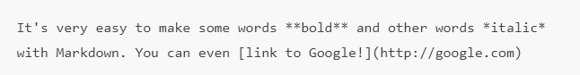

# **Markdown**
## What is Markdown?
*Markdown is a lightweight and easy-to-use syntax for styling all forms of writing on the GitHub platform, and a way to style text on the web*
 #### Formatting words in bold or italics, adding images, and creating lists are just a few of the things we can do with Markdown. Mostly, Markdown is just plain text with a few non-alphabetic characters, like # or *.
 * It's very easy to make some words (**bold**) Just put two stars on either side of the word to make it bold such example below, and other words (*italic*) with Markdown. You can even ([link to Google!](http://google.com))
 
 

+ *Here’s an overview of som Markdown syntax that you can use anywhere on GitHub.com or in your own text files.*

GitHub.com uses its own version of the Markdown syntax that provides an additional set of useful features, many of which make it easier to work with content on GitHub.com.

### **GitHub Pages**

+ GitHub Pages is a static site hosting service that takes HTML, CSS, and JavaScript files straight from a repository on GitHub, optionally runs the files through a build process, and publishes a website. You can see examples of GitHub Pages sites in the GitHub Pages examples collection.
* You can host your site on GitHub's github.io domain or your own custom domain. For more information, see "Using a custom domain with GitHub Pages."
* If your project site is published from a private or internal repository owned by an organization using GitHub Enterprise Cloud, you can manage access control for the site. For more information, see "Changing the visibility of your GitHub Pages site."
* Organization owners can disable the publication of GitHub Pages sites from the organization's repositories. For more information, see "Managing the publication of GitHub Pages sites for your organization."

*and to know more About GitHub Pages visit this*[ link ](https://docs.github.com/en/pages/getting-started-with-github-pages/about-github-pages)
