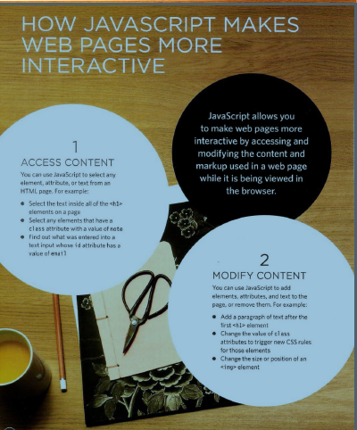

# Is it hard to Learn?

## *How Peopl does Access the Web?*

- **through using**
- Browsers
- Web Servers
- Screen readers
- Devices

## How the Web Works?

* When you visit a website, the web server
hosting that site could be anywhere in the
world. In order for you to find the location of
the web server, your browser will first connect
to a Domain Name System (DNS) server.

* Your computer contacts a
network of servers called
Domain Name System (DNS)
servers. These act like phone
books; they tell your computer
the IP address associated with
the requested domain name.
An IP address is a number
of up to 12 digits separated
by periods / full stops. Every
device connected to the web
has a unique IP address; it is
like the phone number for that
computer.

* The unique number that the
DNS server returns to your
computer allows your browser
to contact the web server
that hosts the website you
requested. A web server is a
computer that is constantly
connected to the web, and is set
up especially to send web pages
to users.

* The web server then sends the
page you requested back to your
web browser.

**HTM L Us es El ements to Describe theStructure of Pages**

* *Tags act like containers. They tell you something about the information that lies between their opening and closing tags.*

**Attributes Tell Us More About El ements**

* *Attributes provide additional information
about the contents of an element. They appear
on the opening tag of the element and are
made up of two parts: a name and a value,
separated by an equals sign.*

* *HTML5 allows you to use
uppercase attribute names and
omit the quotemarks, but this is
not recommended.*

The majority of attributes can
only be used on certain
elements, although a few
attributes (such as lang)
can appear on any element.

Most attribute values are
either pre-defined or follow a
stipulated format. We will look
at the permitted values as we

introduce each new attribute.
The value of the lang attribute
is an abbreviated way of
specifying which language is
used inside the element that
all browsers understand.

**Escape Characters**

* *There are some characters that are used in
and reserved by HTML code. (For example, the
left and right angled brackets.)*

Therefore, if you want these
characters to appear on your
page you need to use what are
termed "escape" characters
(also known as escape codes or
entity references). For example,
to write a left angled bracket,
you can use either &lt; or
&#60;. For an ampersand, you
can use either &amp; or &#38;.
There are also special codes
that can be used to show
symbols such as copyright and
trademark, currency symbols,
mathematical characters, and
some punctuation marks. For
example, if you want to include a
copyright symbol on a web page
you can use either &copy; or
&#169;.
When using escape characters,
it is important to check the
page in your browser to ensure
that the correct symbol shows
up. This is because some fonts
do not support all of these
characters and you might
therefore need to specify
a different font for these
characters in your CSS code.

**Site Maps**

* *The aim is to create a diagram
of the pages that will be used
to structure the site. This is
known as a site map and it will
show how those pages can be
grouped.*
*To help you decide what
information should go on each
page, you can use a technique
called card sorting.*
*This involves placing each
piece of information that a
visitor might need to know on
a separate piece of paper and
then organizing the related
information into groups.*
*Each group relates to a page and,
on larger sites the, pages can in
turn can be grouped together to
create different sections of the
website.*
*The groups of information are
then turned into the diagram
that is known as the site map.
Sometimes it can be helpful to
ask people who are the target
audience to help you group
related information together.
A site map will usually
begin with the homepage.*
*Additionally, if the site is large
and is compartmentalized
into sections, each section
might require its own section
homepage to link to all of the
information within it.
For example, most online shops
have section homepages for
each type of product, which then
in turn link to individual product
pages.*
*You may need to duplicate some
information if it needs to appear
on more than one page.
The pages (or groups of pages)
will inform how users navigate
through the site.
Remember to focus on the
goals that your visitors want to
achieve.*
*It is worth noting that the
site owner might organize
information in a way that is
different to what the public
expects. It is important to reflect
the public's understanding of the
subject (rather than just the site
owner's understanding of it).*

**HOW A BROWSER SEES A WEB PAGE**

* In order to understand how you can change the content of an HTML
page using JavaScript, you need to know how a browser interprets the
HTML code and applies styling to it.

1. RECEIVE A PAGE AS
HTML CODE
2. CREATE A MODEL OF
THE PAGE AND STORE
IT IN MEMORY
3. USE A RENDERING
ENGINE TO SHOW THE
PAGE ON SCREEN

* All major browsers use a JavaScript interpreter to translate your
instructions (in JavaScript) into instructions the computer can follow.

When you use JavaScript in
the browser, there is a part of
the browser that is called an
interpreter (or scripting engine).
40 THE ABC OF PROGRAMMING
The interpreter takes your
instructions (in JavaScript) and
translates them into instructions
the browser can use to achieve
the tasks you want it to perform.
In an interpreted programming
language, like JavaScript. each
line of code is translated
one-by-one as the script is run.

