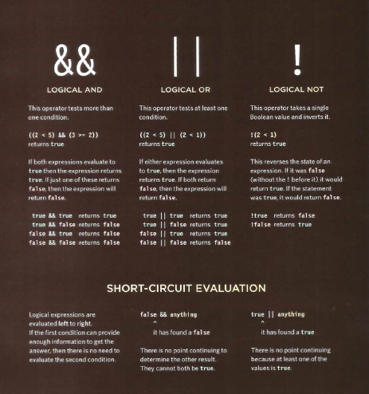

# Text

When creating a web page, you add tags
(known as markup) to the contents of the
page. These tags provide extra meaning
and allow browsers to show users the
appropriate structure for the page.

## Headings

HTML has six "levels" of
headings:
<h1> is used for main headings
<h2> is used for subheadings
If there are further sections
under the subheadings then the
<h3> element is used, and so
on...
Browsers display the contents of
headings at different sizes. The
contents of an <h1> element is
the largest, and the contents of
an <h6> element is the smallest.
The exact size at which each
browser shows the headings
can vary slightly. Users can also
adjust the size of text in their
browser. You will see how to
control the size of text, its color,
and the fonts used when we
come to look at CSS.

## Paragraph 

To create a paragraph, surround
the words that make up the
paragraph with an opening 

tag and closing 
 tag.
By default, a browser will show
each paragraph on a new line
with some space between it and
any subsequent paragraphs.

## Bold & It alic

 # <b>

By enclosing words in the tags
<b> and </b> we can make
characters appear bold.
The <b> element also represents
a section of text that would be
presented in a visually different
way (for example key words in a
paragraph) although the use of
the <b> element does not imply
any additional meaning.

 # <i>

By enclosing words in the tags
<i> and </i> we can make
characters appear italic.
The <i> element also represents
a section of text that would be
said in a different way from
surrounding content — such as
technical terms, names of ships,
foreign words, thoughts, or other
terms that would usually be
italicized.

## Superscript & Subscript

# 

The  element is used
to contain characters that
should be superscript such
as the suffixes of dates or
mathematical concepts like
raising a number to a power such
as 22.

# 

The  element is used to
contain characters that should
be subscript. It is commonly
used with foot notes or chemical
formulas such as H20.

## White Sp ace

In order to make code easier to
read, web page authors often
add extra spaces or start some
elements on new lines.
When the browser comes across
two or more spaces next to each
other, it only displays one space.
Similarly if it comes across a line
break, it treats that as a single
space too. This is known as
white space collapsing.
You will often see that web page
authors take advantage of white
space collapsing to indent their
code in order to make it easier
to follow.

## Line Breaks & Horizontal Rules

#  

As you have already seen, the
browser will automatically show
each new paragraph or heading
on a new line. But if you wanted
to add a line break inside the
middle of a paragraph you can
use the line break tag  .

# 

To create a break between
themes — such as a change of
topic in a book or a new scene
in a play — you can add a
horizontal rule between sections
using the 
 tag.
There are a few elements that
do not have any words between
an opening and closing tag. They
are known as empty elements
and they are written differently.
An empty element usually
has only one tag. Before the
closing angled bracket of an
empty element there will often
be a space and a forward slash
character. Some web page
authors miss this out but it is a
good habit to get into.

## St rong & Emph asis

# <strong>

The use of the <strong>
element indicates that its
content has strong importance.
For example, the words
contained in this element might
be said with strong emphasis.
By default, browsers will show
the contents of a <strong>
element in bold.

# <em>

The <em> element indicates
emphasis that subtly changes
the meaning of a sentence.
By default browsers will show
the contents of an <em> element
in italic.

## Quotations

# <blockquote>

The blockquote element is
used for longer quotes that take
up an entire paragraph. Note
how the 
 element is still
used inside the blockquote
element.
Browsers tend to indent the
contents of the blockquote
element, however you should not
use this element just to indent a
piece of text — rather you should
achieve this effect using CSS.

# <q>

The <q> element is used for
shorter quotes that sit within
a paragraph. Browsers are
supposed to put quotes around
the <q> element, however
Internet Explorer does not —
therefore many people avoid
using the <q> element.
Both elements may use the cite
attribute to indicate where the
quote is from. Its value should
be a URL that will have more
information about the source of
the quotation.

## Abb reviations & Acronyms

# <abbr> 

If you use an abbreviation or
an acronym, then the <abbr>
element can be used. A title
attribute on the opening tag is
used to specify the full term.
In HTML 4 there was a separate
<acronym> element for
acronyms. To spell out the full
form of the acronym, the title
attribute was used (as with the
<abbr> element above). HTML5
just uses the <abbr> element
for both abbreviations and
acronyms.

## Citations & Definitions

# <cite>

When you are referencing a
piece of work such as a book,
film or research paper, the
<cite> element can be used
to indicate where the citation is
from.
In HTML5, <cite> should not
really be used for a person's
name — but it was allowed in
HTML 4, so most people are
likely to continue to use it.
Browsers will render the content
of a <cite> element in italics.

# <dfn> 

The first time you explain some
new terminology (perhaps an
academic concept or some
jargon) in a document, it is
known as the defining instance
of it.
The <dfn> element is used to
indicate the defining instance of
a new term.
Some browsers show the
content of the <dfn> element in
italics. Safari and Chrome do not
change its appearance.

## Auth or Details

# <address> 

The <address> element has
quite a specific use: to contain
contact details for the author of
the page.
It can contain a physical address,
but it does not have to. For
example, it may also contain a
phone number or email address.
Browsers often display the
content of the <address>
element in italics.
You may also be interested in
something called the hCard
microformat for adding physical
address information to your
markup.

## Changes to Content

# <ins>
# <del>

The <ins> element can be used
to show content that has been
inserted into a document, while
the <del> element can show text
that has been deleted from it.
The content of a <ins> element
is usually underlined, while the
content of a <del> element
usually has a line through it.

# <s>

The <s> element indicates
something that is no longer
accurate or relevant (but that
should not be deleted).
Visually the content of an <s>
element will usually be displayed
with a line through the center.
Older versions of HTML had a
<u> element for content that
was underlined, but this is being
phased out.

# *Introducing CSS*

CSS Associates Style
rules with HT ML
elements

* CSS works by associating rules with HTML elements. These rules govern
how the content of specified elements should be displayed. A CSS rule
contains two parts: a selector and a declaration.

This rule indicates that all 

elements should be shown in the
Arial typeface.
Selectors indicate which
element the rule applies to.
The same rule can apply to
more than one element if you
separate the element names
with commas.
Declarations indicate how
the elements referred to in
the selector should be styled.
Declarations are split into two
parts (a property and a value),
and are separated by a colon.

# *CSS Properties Affect How El ements Are Dis played

CSS declarations sit inside curly brackets and each is made up of two
parts: a property and a value, separated by a colon. You can specify
several properties in one declaration, each separated by a semi-colon.

This rule indicates that all <h1>,
<h2> and <h3> elements
should be shown in the Arial
typeface, in a yellow color.
Properties indicate the aspects
of the element you want to
change. For example, color, font,
width, height and border.
Values specify the settings
you want to use for the chosen
properties. For example, if you
want to specify a color property
then the value is the color you
want the text in these elements
to be.

## Usi ng External CSS

## <link>

 external-css.html HTML
The <link> element can be used
in an HTML document to tell the
browser where to find the CSS
file used to style the page. It is an
empty element (meaning it does
not need a closing tag), and it
lives inside the <head> element.
It should use three attributes:

## href

This specifies the path to the
CSS file (which is often placed in
a folder called css or styles).

## type

This attribute specifies the type
of document being linked to. The
value should be text/css.

## rel

This specifies the relationship
between the HTML page and
the file it is linked to. The value
should be stylesheet when
linking to a CSS file.
An HTML page can use more
than one CSS style sheet. To
do this it could have a <link>
element for every CSS file it
uses. For example, some authors
use one CSS file to control the
presentation (such as fonts and
colors) and a second to control
the layout.

