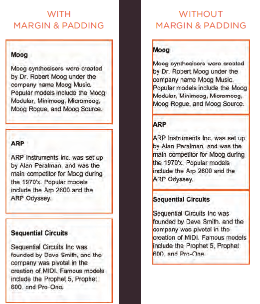
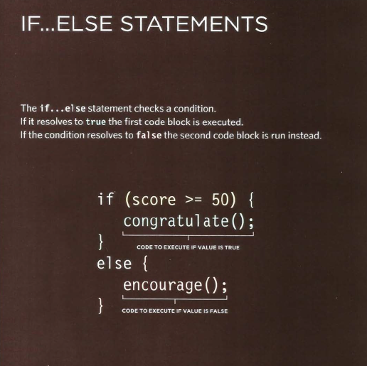
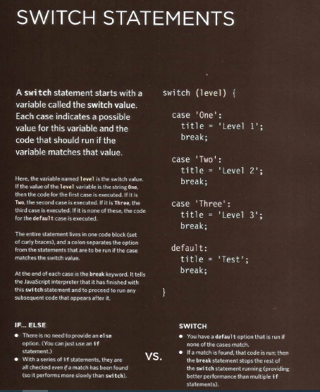
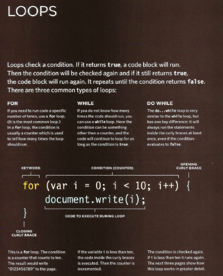
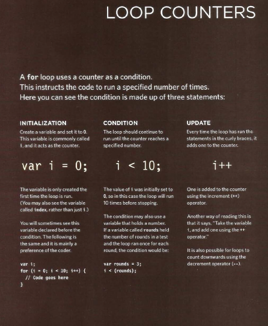
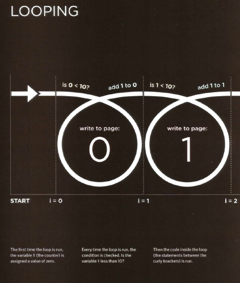
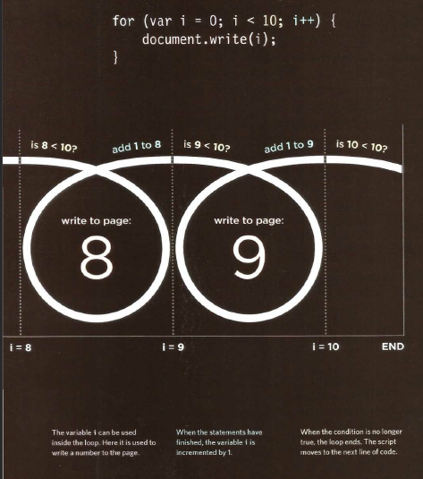

#  HTML Lists, Control Flow with JS, and the CSS Box Model

## Lists

**Ordered Lists**

- \<ol>

The ordered list is created with
the \<ol> element.

- \<li>

Each item in the list is placed
between an opening \<li> tag
and a closing \</li> tag. (The li
stands for list item.)
Browsers indent lists by default.
Sometimes you may see a type
attribute used with the \<ol>
element to specify the type of
numbering (numbers, letters,
roman numerals and so on).
.
**Unordered Lists**
- \<ul>

The unordered list is created
with the \<ul> element.

- \<li>

Each item in the list is placed
between an opening \<li> tag
and a closing \</li> tag. (The li
stands for list item.)
Browsers indent lists by default.
Sometimes you may see a type
attribute used with the \<ul>
element to specify the type of
bullet point (circles, squares,
diamonds and so on).

**Definition Lists**

- \<dl>

The definition list is created with
the \<dl> element and usually
consists of a series of terms and
their definitions.
Inside the \<dl> element you will
usually see pairs of \<dt> and
\<dd> elements.

- \<dt>

This is used to contain the term
being defined (the definition
term).

- \<dd>

This is used to contain the
definition.
Sometimes you might see a list
where there are two terms used
for the same definition or two
different definitions for the same
term.

**Nested Lists**

You can put a second list inside
an \<li> element to create a sublist
or nested list.
Browsers display nested lists
indented further than the parent
list. In nested unordered lists,
the browser will usually change
the style of the bullet point too.

+ ## *Summary*

+ There are three three ypes of HTML lists: ordered,
unordered, and definition.
+ Ordered lists use numbers.
+ Unordered lists use bullets.
+ Definition lists are used to define terminology.
+ Lists can be nested inside one another.

# Boxes

### **Border, Margin & Padding**

Every box has three available properties that
can be adjusted to control its appearance:

1.  Border
Every box has a border (even if
it is not visible or is specified to
be 0 pixels wide). The border
separates the edge of one box
from another.

2. Margin
Margins sit outside the edge
of the border. You can set the
width of a margin to create a
gap between the borders of two
adjacent boxes.

3. Padding
Padding is the space between
the border of a box and any
content contained within it.
Adding padding can increase the
readability of its contents.

If you specify a width
for a box, then the
borders, margin, and
padding are added to
its width and height.

**White space & Vertical Margin**

The padding and
margin properties
are very helpful
in adding space
between various
items on the page.

Designers refer to the space
between items on a page as
white space. Imagine you had
a border around a box. You
would not want the text to touch
this border or it would become
harder to read.

Or, imagine you had two boxes
sitting side by side (each with
a black border). You would not
necessarily want the boxes to
touch edges as this would make
the line look twice as thick on
the facing sides.

If the bottom margin of any
box touches the top margin of
another, the browser will render
it differently than you might
expect. It will only show the
larger of the two margins. If both
margins are the same size, it will
only show one.

+ ## *Summary* boxes

+ CSS treats each HTML element as if it has its own box.
+ You can use CSS to control the dimensions of a box.
+ You can also control the borders, margin and padding
for each box with CSS.
+ It is possible to hide elements using the display and
visibility properties.
+ Block-level boxes can be made into inline boxes, and
inline boxes made into block-level boxes.
+ Legibility can be improved by controlling the width of
boxes containing text and the leading.
+ CSS3 has introduced the ability to create image
borders and rounded borders.

# CREATING AN ARRAY

You create an array and give it
a name just like you would any
other variable (using the var
keyword followed by the name of
the array).
The values are assigned to the
array inside a pair of square
brackets, and each value is
separated by a comma. The
values in the array do not need
to be the same data type, so you
can store a string, a number and
a Boolean all in the same array.
This technique for creating
an array is known as an array
literal. It is usually the preferred
method for creating an array.
You can also write each value on
a separate line:

colors= ['white',
'black',
'custom'];

## VALUES IN ARRAYS

Values in an array are accessed as if they are in
a numbered list. It is important to know that the
numbering of this list starts at zero (not one).

- NUMBERING ITEMS IN
AN ARRAY

Each item in an array is
automatically given a number
called an index. This can be used
to access specific items in the
array. Consider the following
array which holds three colors:

\- var col ors;
colors= ['whi te ' ,
'black ' ,
' custom'];

Confusingly, index values start at
0 (not 1), so the following table
shows items from the array and
their corresponding index values:

  | INDEX       |    VALUE     |
  | ----------- | ------------ |
  |      0      |    'white '  |
  |      1      |    'bl ack'  |
  |      2      |    'custom'  |

+ ACCESSING ITEMS IN
AN ARRAY

To retrieve the third item on the
list, the array name is specified
along with the index number in
square brackets.
Here you can see a variable
called i temThree is declared.
Its value is set to be the third
color from the co 1 ors array.

\- var itemThr ee;
itemThree = colors [ 2] ;

+ NUMBER OF ITEMS IN
AN ARRAY

Each array has a property called
length, which holds the number
of items in the array.
Below you can see that a variable
called numCo 1 ors is declared. Its
value is set to be the number of
the items in the array.
The name of the array is
followed by a period symbol (or
full stop) which is then followed
by the 1 ength keyword.

\- var numColors ;
numColors =colors. length;

## ACCESSING & CHANGING VALUES IN AN ARRAY

create an array containing a list
of three colors. (The values can
be added on the same line or on
separate lines as shown here.)
Having created the array, the
third item on the list is changed
from 'custom' to 'beige'.
To access a value from an array,
after the array name you specify
the index number for that value
inside square brackets.
You can change the value of an
item an array by selecting it and
assigning it a new value just as
you would any other variable
(using the equals sign and the
new value for that item).
In the last two statements, the
newly updated third item in the
array is added to the page.

\// Create the array

var colors = ['white',
'black' ,
'custom']; 

\// Update the third item in the array

colors[2] = 'beige ' ;

\// Get the element with an id of colors

var el = document .getElementByid(' colors') ;

\// Replace with third item from the array

el .textContent = colors[2];

## if statement, switch & loops

+ ## *Summary* loops

- if ... else statements allow you to run one set of code if a condition is true, and another if it is false.
- switch statements allow you to compare a value
against possible outcomes (and also provides a default
option if none match).
- Data types can be coerced from one type to another.
- All values evaluate to either truthy or falsy.
- There are three types of loop: for, while, and
do ... while. Each repeats a set of statements.
