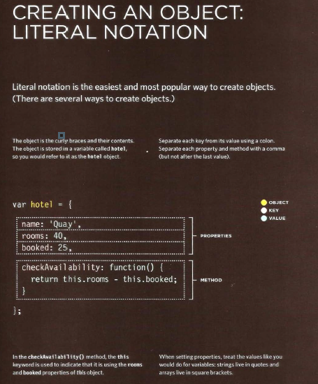
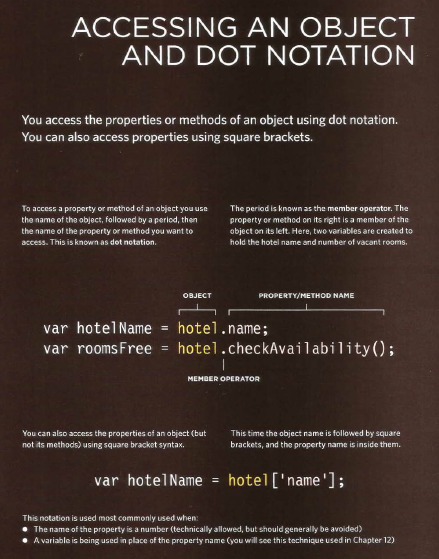
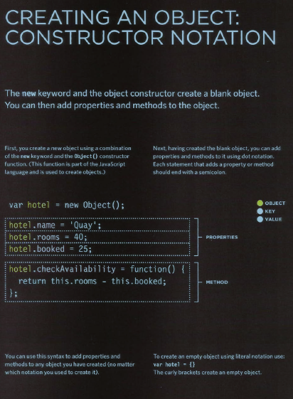
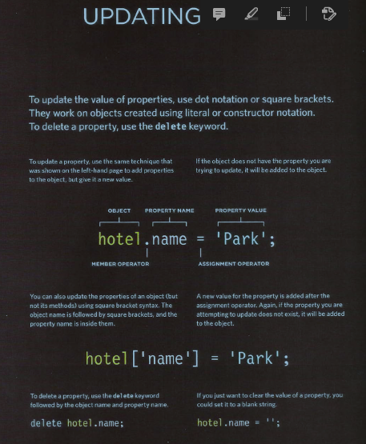
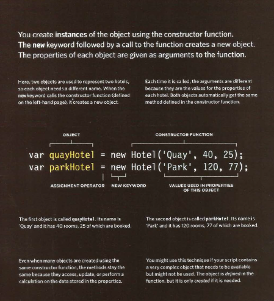
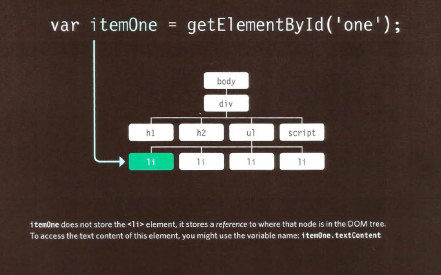

# Problem Domain, Objects, and the DOM

- This example starts by creating
an object using litera l notation.
This object is called hotel which
represents a hotel called Quay
with 40 rooms (25 of which have
been booked).
Next, the content of the page
is updated with data from this
object. It shows the name of the
hotel by accessing the object's
name property and the number
of vacant rooms using the
checkAvail ability() method.
To access a property of this
object, the object name is
followed by a dot (the period
symbol) and the name of the
property that you want.
Similarly, to use the method,
you can use the object name
followed by the method name.
hotel .checkAvailability()
If the method needs parameters,
you can supply them in the
parentheses (just like you can
pass arguments to a funct ion).

- Here you can see another object.
Again it is called hote 1, but this
time the model represents a
different hotel. For a moment,
imagine that this is a different
page of the same travel website.
The Park hotel is larger. It has
120 rooms and 77 of them are
booked.
The only things changing in the
code are the va lues of the hot e 1
object's properties:
• The name of the hotel
• How many rooms it has
• How many rooms are booked
The rest of the page works in
exactly the same way. The name
is shown using the same code.
The checkAvai 1 abi l ity()
method has not changed and is
called in the same way.
If this site had 1,000 hotels,
the only thing that would
need to change would be the
three properties of this object.
Because we created a model for
the hotel using data, the same
code can access and display the
details for any hotel that follows
the same data model.
If you had two objects on the
same page, you would create
each one using the same
notation but store them in
variables with different names.

## Document Object Model (DOM)

**CACHING DOM QUERIES**

 Methods that find elements in the DOM tree are called DOM queries. When you need to work with an element more than once, you should use a variable to store the result of this query. Below, the interpreter is told to look through the DOM tree for an element whose 1dattribute has a value of one. Once it has found the node that ue saajas duse uaUA element to access or update. the interpreter must find the element(s) in the DOM tree. represents the element(s), you can work with that node, its parent, or any children.
 
  *getElementById('one');*

  

  When people talk about storing elements in variables, they are really storing the location of the element(s) within the DOM tree in a variable. The properties and methods of that element node work on the variable. If your script needs to use the the same element(s) more than once, you can store the location of the element(s) in a variable. This saves the browser looking through the DOM tree to find the same element(s)ragain. It is known as caching the selection. Programmers would say that the varlable stores a reference to the object in the DOM tree. (It is storing the location of the node.)

**DOM and JavaScript**

The short example above, like nearly all of the examples in this reference, is JavaScript. That is to say, it's written in JavaScript, but it uses the DOM to access the document and its elements. The DOM is not a programming language, but without it, the JavaScript language wouldn't have any model or notion of web pages, HTML documents, XML documents, and their component parts (e.g. elements). Every element in a document—the document as a whole, the head, tables within the document, table headers, text within the table cells—is part of the document object model for that document, so they can all be accessed and manipulated using the DOM and a scripting language like JavaScript.

In the beginning, JavaScript and the DOM were tightly intertwined, but eventually, they evolved into separate entities. The page content is stored in the DOM and may be accessed and manipulated via JavaScript, so that we may write this approximative equation:

API = DOM + JavaScript

The DOM was designed to be independent of any particular programming language, making the structural representation of the document available from a single, consistent API. Though we focus exclusively on JavaScript in this reference documentation, implementations of the DOM can be built for any language, as this Python example demonstrates:

**Accessing the DOM**

You don't have to do anything special to begin using the DOM. Different browsers have different implementations of the DOM, and these implementations exhibit varying degrees of conformance to the actual DOM standard (a subject we try to avoid in this documentation), but every web browser uses some document object model to make web pages accessible via JavaScript.

When you create a script–whether it's inline in a \
  \</head>

  \<body>

  \</body>

\</html>

-------------------------------------------

**DOM interfaces**

This guide is about the objects and the actual things you can use to manipulate the DOM hierarchy. There are many points where understanding how these work can be confusing. For example, the object representing the HTML form element gets its name property from the HTMLFormElement interface but its className property from the HTMLElement interface. In both cases, the property you want is in that form object.

But the relationship between objects and the interfaces that they implement in the DOM can be confusing, and so this section attempts to say a little something about the actual interfaces in the DOM specification and how they are made available.

**Interfaces and Objects**

Many objects borrow from several different interfaces. The table object, for example, implements a specialized HTMLTableElement interface, which includes such methods as createCaption and insertRow. But since it's also an HTML element, table implements the Element interface described in the DOM Element Reference chapter. And finally, since an HTML element is also, as far as the DOM is concerned, a node in the tree of nodes that make up the object model for an HTML or XML page, the table object also implements the more basic Node interface, from which Element derives.

When you get a reference to a table object, as in the following example, you routinely use all three of these interfaces interchangeably on the object, perhaps without knowing it

**Core Interfaces in the DOM**

This section lists some of the most commonly-used interfaces in the DOM. The idea is not to describe what these APIs do here but to give you an idea of the sorts of methods and properties you will see very often as you use the DOM. These common APIs are used in the longer examples in the DOM Examples chapter at the end of this book.

The document and window objects are the objects whose interfaces you generally use most often in DOM programming. In simple terms, the window object represents something like the browser, and the document object is the root of the document itself. Element inherits from the generic Node interface, and together these two interfaces provide many of the methods and properties you use on individual elements. These elements may also have specific interfaces for dealing with the kind of data those elements hold, as in the table object example in the previous section.

