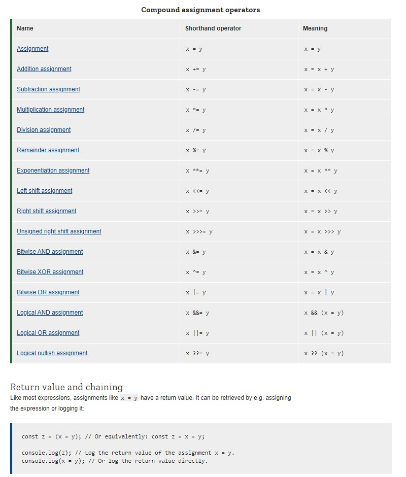

# **Expressions and operators**

This chapter describes JavaScript's expressions and operators, including assignment, comparison, arithmetic, bitwise, logical, string, ternary

## Operators

**Assignment operators**

An assignment operator assigns a value to its left operand based on the value of its right operand. The simple assignment operator is equal (=), which assigns the value of its right operand to its left operand. That is, x = y assigns the value of y to x.

The return value matches the expression to the right of the = sign in the “Meaning” column of the table above. That means that (x = y) returns y, (x += y) returns the resulting sum x + y, (x **= y) returns the resulting power x ** y, and so on.

In the case of logical assignments, (x &&= y), (x ||= y), and (x ??= y), the return value is that of the logical operation without the assignment, so x && y, x || y, and x ?? y, respectively.

Note that the return values are always based on the operands’ values before the operation.

When chaining these expressions, each assignment is evaluated right-to-left. Consider these examples:

- w = z = x = y is equivalent to w = (z = (x = y)) or x = y; z = y; w = y
 - z += x *= y is equivalent to z += (x *= y) or tmp = x * y; x *= y; z += tmp (except without the tmp).

**Destructuring**

For more complex assignments, the destructuring assignment syntax is a JavaScript expression that makes it possible to extract data from arrays or objects using a syntax that mirrors the construction of array and object literals.

    var foo = ['one', 'two', 'three'];

    // without destructuring
    var one   = foo[0];
    var two   = foo[1];
    var three = foo[2];

    // with destructuring
    var [one, two, three] = foo;

&nbsp

   **Comparison operators**

A comparison operator compares its operands and returns a logical value based on whether the comparison is true. The operands can be numerical, string, logical, or object values. Strings are compared based on standard lexicographical ordering, using Unicode values. In most cases, if the two operands are not of the same type, JavaScript attempts to convert them to an appropriate type for the comparison. This behavior generally results in comparing the operands numerically. The sole exceptions to type conversion within comparisons involve the === and !== operators, which perform strict equality and inequality comparisons. These operators do not attempt to convert the operands to compatible types before checking equality. The following table describes the comparison operators in terms of this sample code:

    var var1 = 3;
    var var2 = 4;

**Arithmetic operators**

An arithmetic operator takes numerical values (either literals or variables) as their operands and returns a single numerical value. The standard arithmetic operators are addition (+), subtraction (-), multiplication (*), and division (/). These operators work as they do in most other programming languages when used with floating point numbers (in particular, note that division by zero produces Infinity). For example:

    1 / 2; // 0.5
    1 / 2 == 1.0 / 2.0; // this is true

   **Bitwise operators**

A bitwise operator treats their operands as a set of 32 bits (zeros and ones), rather than as decimal, hexadecimal, or octal numbers. For example, the decimal number nine has a binary representation of 1001. Bitwise operators perform their operations on such binary representations, but they return standard JavaScript numerical values.

The following table summarizes JavaScript's bitwise operators.

**Bitwise  operators**

    Operator	         Usage        Description
    Bitwise AND	        a & b	      Returns a one in each bit position for which the corresponding bits of both operands are ones.
    Bitwise OR        	a | b	      Returns a zero in each bit position for which the corresponding bits of both operands are zeros.
    Bitwise XOR	        a ^ b     	Returns a zero in each bit position for which the corresponding bits are the same.
    [Returns a one in each bit position for which the corresponding bits are different.]
    Bitwise NOT	         ~ a    	Inverts the bits of its operand.
    Left shift               a << b	        Shifts a in binary representation b bits to the left, shifting in zeros from the right.

    Sign-propagating right shif	a >> b     	Shifts a in binary representation b bits to the right, discarding bits shifted off.
    Zero-fill right shift	 a >>> b	 Shifts a in binary representation b bits to the right, discarding bits shifted off, and shifting in zeros from the left.

## Loops and iteration

Loops offer a quick and easy way to do something repeatedly. This chapter of the JavaScript Guide introduces the different iteration statements available to JavaScript.

You can think of a loop as a computerized version of the game where you tell someone to take X steps in one direction, then Y steps in another. For example, the idea "Go five steps to the east" could be expressed this way as a loop:

    for (let step = 0; step < 5; step++) {
    // Runs 5 times, with values of step 0 through 4.
    console.log('Walking east one step');
    }
There are many different kinds of loops, but they all essentially do the same thing: they repeat an action some number of times. (Note that it's possible that number could be zero!)

The various loop mechanisms offer different ways to determine the start and end points of the loop. There are various situations that are more easily served by one type of loop over the others.

The statements for loops provided in JavaScript are:

- [for statement](https://developer.mozilla.org/en-US/docs/Web/JavaScript/Guide/Loops_and_iteration#for_statement)

- [do...while statement](https://developer.mozilla.org/en-US/docs/Web/JavaScript/Guide/Loops_and_iteration#do...while_statement)
- [while statement](https://developer.mozilla.org/en-US/docs/Web/JavaScript/Guide/Loops_and_iteration#while_statement)
- [labeled statement](https://developer.mozilla.org/en-US/docs/Web/JavaScript/Guide/Loops_and_iteration#labeled_statement)
- [break statement](https://developer.mozilla.org/en-US/docs/Web/JavaScript/Guide/Loops_and_iteration#break_statement)
- [continue statement](https://developer.mozilla.org/en-US/docs/Web/JavaScript/Guide/Loops_and_iteration#continue_statement)
 -[for...in statement](https://developer.mozilla.org/en-US/docs/Web/JavaScript/Guide/Loops_and_iteration#for...in_statement)
- [for...of statement](https://developer.mozilla.org/en-US/docs/Web/JavaScript/Guide/Loops_and_iteration#for...of_statement)

to know more please visit this [link](https://developer.mozilla.org/en-US/docs/Web/JavaScript/Guide/Expressions_and_Operators#bitwise_operators).