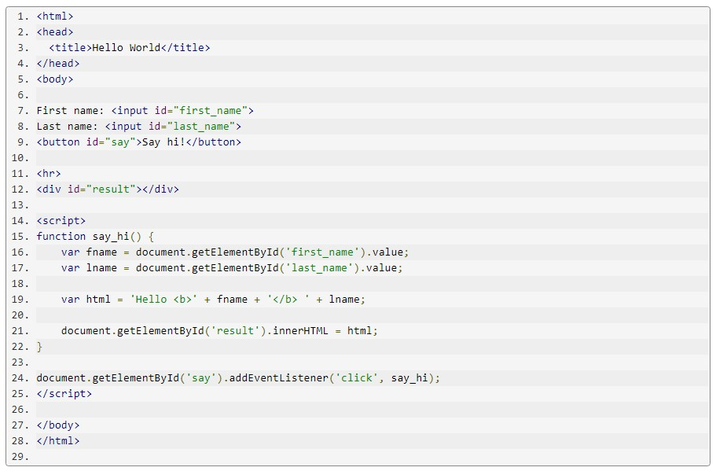

# JavaScript

## *What is JavaScript?*

&nbsp
JavaScript (JS) is a lightweight, interpreted, or just-in-time compiled programming language with first-class functions. While it is most well-known as the scripting language for Web pages, many non-browser environments also use it, such as Node.js, Apache CouchDB and Adobe Acrobat. JavaScript is a prototype-based, multi-paradigm, single-threaded, dynamic language, supporting object-oriented, imperative, and declarative (e.g. functional programming) styles.

## *what is The standards for JavaScript?*

&nbsp
The standards for JavaScript are the ECMAScript Language Specification (ECMA-262) and the ECMAScript Internationalization API specification (ECMA-402). The JavaScript documentation throughout MDN is based on the latest draft versions of ECMA-262 and ECMA-402. And in cases where some proposals for new ECMAScript features have already been implemented in browsers, documentation and examples in MDN articles may use some of those new features.

&nbsp

### **is JavaScript seems like java?**

&nbsp
Do not confuse JavaScript with the Java programming language. Both "Java" and "JavaScript" are trademarks or registered trademarks of Oracle in the U.S. and other countries. However, the two programming languages have very different syntax, semantic, and use.

&nbsp

&nbsp
### **examples of JavaScript !**

 

In this example we have a bit more HTML than earlier. In addition to having a button, and a div element where we'll show our results, we also have two input elements. Each one with its own ID.

If you click on the Try link, you'll see two input boxes and a button:

In the JavaScript code we have a function called say_hi. It used the getElementById we have already seen to locate the DOM element representing the input element with the id first_name. The object returned has a method value that will return the text the user has typed in that field.

We use this technique to retrieve the content of both input fields and assign their content to two variables: fname and lname.

Then, using these variable we create an HTML snippet and assign it to a new variable called html.

Then we set the innerHTML attribute as earlier to show the HTML we generated. The result might look like this:

### *to know more about javascript visit this* [link](https://www.w3schools.com/js/default.asp)

